# IoT & Edge Computing Project: Adaptive Sampling and LoRaWAN communication on ESP32

This repository documents a complete Edge-to-Cloud infrastructure developed to optimize the collection, analysis, and transmission of sensor data in IoT environments. The project implements advanced *Edge Computing* techniques, local digital signal processing (integrated FFT), statistical anomaly filtering, and adaptive transmission utilizing MQTT and LoRaWAN protocols.

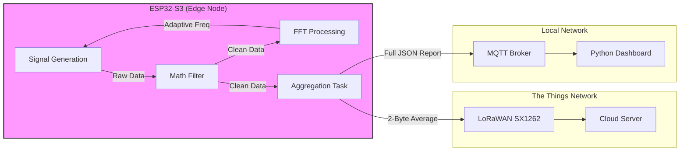
*Figure 1: High-level architectural flowchart (ESP32 -> Edge Filters -> MQTT/LoRaWAN -> Cloud).*

---

## 1. The Iterative Development Process ("Digital Twin")
The firmware development strictly adhered to the "Digital Twin" methodology, structured in two distinctive phases to mitigate risk and validate the algorithmic logic independently of physical hardware constraints.

### Phase 1: Simulation (Wokwi)
In the embryonic phase, hardware-in-the-loop simulations were employed via the Wokwi platform. This approach enabled:

- Iterative testing of complex Digital Signal Processing (DSP) logic, such as the Fast Fourier Transform (FFT) extraction.
- Structuring and debugging of operational thread partitioning using FreeRTOS, ensuring stability between task scheduling and inter-process queues (`QueueHandle_t`).
- Validation of the accuracy of anomaly detection filters (Z-Score and Hampel) in an offline and highly predictable environment, completely eliminating theoretical-hardware risks prior to deployment.

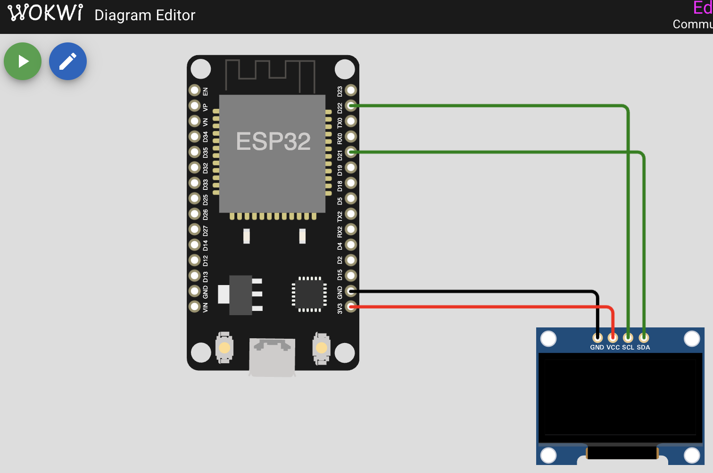

*Figure 2: Wokwi simulation environment setup.*

### Phase 2: Real Hardware and Deployment
Following the successful outcome of the simulations, the firmware was physically ported to the Heltec WiFi LoRa 32 V3 (based on ESP32-S3) board. During this migration, the specific pinout of the physical board was adapted, implementing the correct I2C management for the OLED and the proper manipulation of the logical `VEXT` pin to govern on-demand power delivery to the screen's secondary electronics.

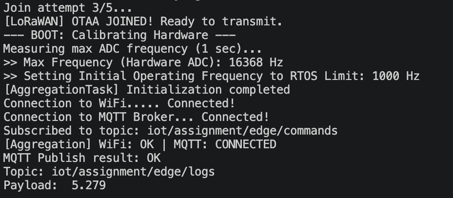

*Figure 3: Initialization of the ESP32-S3.*

---

## 2. Technical Choices and Architectural Justifications
This section constitutes the academic core of the project, detailing the engineering directives that guided the system's implementation.

### Dual-Core RTOS Partitioning and Asynchronous Queues
To guarantee deterministic Real-Time constraints, the workload is explicitly divided between the ESP32's dual cores. Heavy mathematical operations (Signal Generation, FFT, Filtering) are pinned to **Core 1**, utilizing `vTaskDelayUntil()` to prevent timer drift. The network stacks (WiFi, MQTT, LoRaWAN) and the Data Aggregation are pinned to **Core 0**. 
Data decoupling is achieved via FreeRTOS Queues (`xQueueCreate`). The Aggregation task leverages `xQueueReceive(..., portMAX_DELAY)`, forcing the core into a deep Blocked state until data arrives, completely eliminating power-hungry polling loops while avoiding collisions.

### Adaptive Sampling and DSP Windows
The predominant paradigm in classical IoT is continuous oversampling coupled with intensive transmission to cloud-based entities, leading to high latency, bandwidth, and energy consumption overhead. By implementing the Edge Computing paradigm, the firmware analytically computes the Fast Fourier Transform locally at regular intervals, dynamically modulating the sampling timer frequency.

```cpp
if (detected_peak_freq > 1.0) {
    float new_freq = ceil(detected_peak_freq) * 2.0; // Nyquist-Shannon Theorem
    if(new_freq < 10.0) new_freq = 10.0; 
    if(new_freq > 100.0) new_freq = 100.0;
    
    if (current_sampling_freq != new_freq) {
        current_sampling_freq = new_freq;
        sampling_period_ticks = pdMS_TO_TICKS(1000.0 / current_sampling_freq);
    }
}
```

> [!NOTE]
> **Safety Clamping:** The dynamically calculated frequency is explicitly bounded between $10\text{ Hz}$ and $100\text{ Hz}$. The lower bound prevents division-by-zero errors and ensures a minimum system heartbeat, avoiding massive data stalls (e.g., at $1\text{ Hz}$, the buffer would take $64\text{ s}$ to fill, paralyzing the MQTT dashboard). Conversely, the upper bound protects the FreeRTOS scheduler: capping the maximum rate prevents high-frequency noise spikes from causing CPU starvation or triggering a Hardware Watchdog Timer (WDT) reset, guaranteeing production-ready stability.

To optimize the Digital Signal Processing (DSP) and mitigate "Spectral Leakage" from finite windows, a **Hamming Window** (`FFT_WIN_TYP_HAMMING`) is applied to the 64-sample buffer. Furthermore, because the FFT bin resolution is tied to the sampling rate, the `ArduinoFFT` object is dynamically re-initialized in memory every time the frequency modulates.
This adaptability drastically scales down CPU wake-ups, memory footprint, and increases battery efficiency by orders of magnitude compared to processing in a cloud backend.

### DSP Window Size: Latency vs. Accuracy Trade-offs
To fully optimize the DSP pipeline, an empirical evaluation of the sampling window size (N) was conducted, highlighting the strict trade-offs between computational effort, memory footprint, and end-to-end latency. A smaller buffer size (e.g., N=32) minimizes RAM utilization and drastically reduces the end-to-end network delay, allowing for near-instantaneous anomaly reporting. However, it severely compromises the FFT's frequency resolution and weakens the statistical robustness of the filters, as a single outlier carries too much weight in a small sample pool. Conversely, a larger window (e.g., N=128) significantly enhances the spectral resolution and improves the accuracy of the median and MAD estimators used in the Hampel filter. The inherent trade-off is that it doubles the required memory footprint, exponentially increases the *O(N log N)* execution time required for array sorting, and artificially inflates the latency, as the system must wait longer to accumulate the data before transmitting the payload. Consequently, a window size of N=64 was selected as the optimal architectural sweet spot, striking a rigorous balance between reliable anomaly detection, precise adaptive frequency scaling, and adherence to Real-Time responsiveness.

### Physical Limits vs. RTOS Limits
Identifying the maximum sampling limit inherently clashes with two parallel architectures. The firmware adopts an `autoCalibrateADCFrequency()` module within the `setup()`:

```cpp
// Forced execution to physically measure ADC limits
while (micros() - start_time < 1000000) {
    volatile int val = analogRead(4); // Forced constraint via 'volatile'
    count++;
}
```

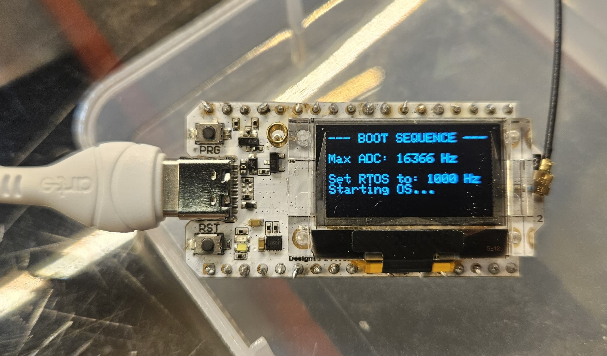

*Figure 4: Initializing the OS on the ESP32-S3.*

This calibration highlights the massive disparity between Hardware constraints (where the ESP32's internal ADC bare-metal speed can easily peak between 10 kHz and 20 kHz) and the FreeRTOS Tick Rate constraints (generally statistically capped at 1000 Hz or 1ms). Therefore, the maximum operational frequency was deliberately capped at the RTOS limitations to prevent buffer underruns.

### Blind Boot and Cascade Adaptation (The 1000 Hz Paradox)
Starting the system at an extremely high sampling rate might initially seem counterintuitive for an energy-saving algorithm, but it is a critical requirement for a truly autonomous Edge node. When the ESP32 powers on, it operates in a "blind" state, unaware of the physical environment it is attached to (e.g., a slow bridge vibrating at $5\text{ Hz}$ vs an industrial turbine vibrating at $400\text{ Hz}$). If the system hardcoded its boot frequency to $10\text{ Hz}$, any high-frequency vibration would trigger severe Aliasing, rendering the FFT permanently blind to the true nature of the signal and trapping the system at an incorrect sampling rate. 

By aggressively booting at the maximum hardware-allowed limit, the FFT casts the widest possible net, covering the entire spectrum up to $500\text{ Hz}$ (Nyquist limit) without any aliasing risk. However, at $1000\text{ Hz}$, the 64-sample buffer fills in just $0.064\text{ s}$, creating a poor frequency resolution of $\sim 15.6\text{ Hz}$. The system correctly manages this through a **Cascade Adaptation**:
1. **First Cycle ($1000\text{ Hz}$):** The FFT detects low-frequency energy but clumps it into the $15.6\text{ Hz}$ bin. It commands a safe downscale to $32\text{ Hz}$.
2. **Second Cycle ($32\text{ Hz}$):** The buffer now takes $2.0\text{ s}$ to fill. The FFT resolution sharpens drastically to $0.5\text{ Hz}$. It clearly resolves the true $5\text{ Hz}$ peak.
3. **Final Adaptation ($10\text{ Hz}$):** The system scales down perfectly to $10\text{ Hz}$, entering its optimal Deep Sleep routine.

This engineered 2-step cascade allows the system to autonomously discover its environment without prior configuration, avoiding aliasing while eventually guaranteeing maximum energy efficiency.

### Out-of-Band Energy Profiling Setup (Dual ESP32 & INA219)
To accurately measure the system's power consumption without skewing the results—a phenomenon known in software engineering as the Observer Effect—an out-of-band hardware profiling methodology was adopted. Instead of embedding energy-measuring routines within the primary firmware, the physical setup utilizes a secondary, dedicated ESP32 paired with an INA219 current sensor. The primary ESP32 acts strictly as the Device Under Test (DUT), running the pure Edge computing and communication tasks (FFT, filtering, LoRaWAN/MQTT) without any added overhead. Meanwhile, the second ESP32 acts as an external data logger, polling the INA219 via I2C to precisely measure the voltage and current draw (mA) of the DUT. This dual-board configuration ensures that the I2C polling latency and mathematical computations required for energy tracking do not interfere with the CPU wake-up cycles of the main system, yielding empirical and completely unadulterated data on the actual power savings achieved by the adaptive sampling algorithm.

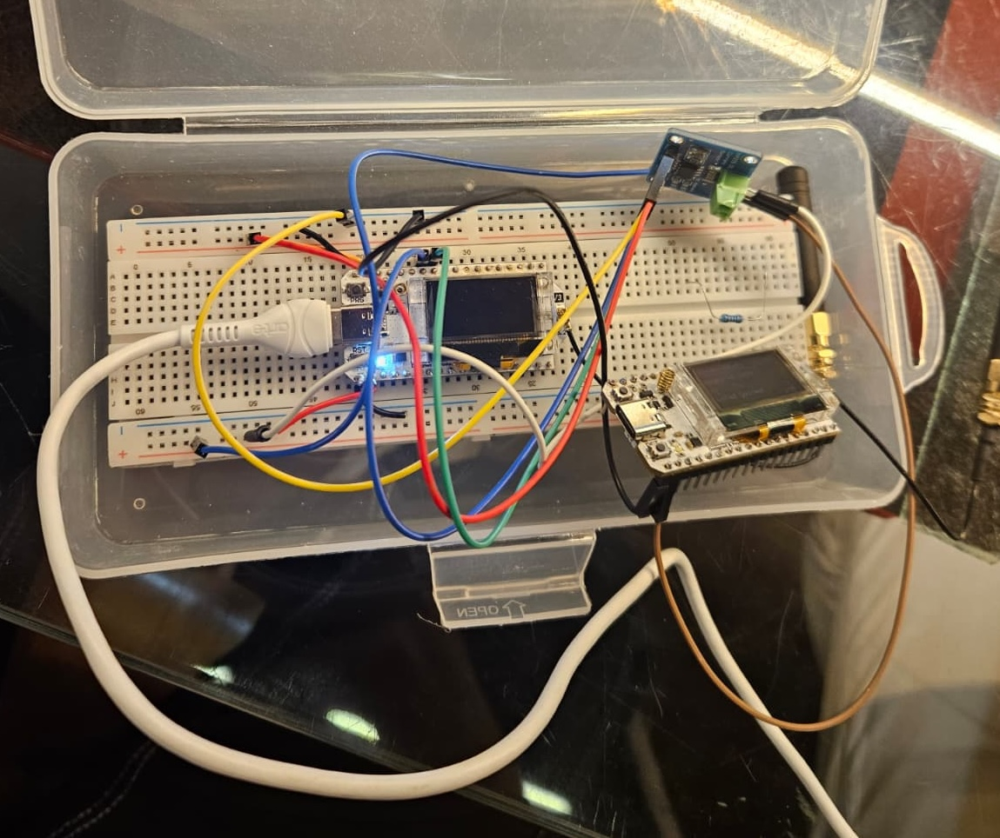

*Figure 5: Heltec WiFi LoRa 32 V3 executing the firmware, showing localized metrics on the OLED screen.*

> **Note:** While the `main.cpp` code only calculates a simulated "logical estimate" of the energy saved based on CPU task wake-ups, the specific consumption data presented in the chart below reflects the **true, verified empirical tests** physically conducted via the dual-ESP32 out-of-band hardware setup.


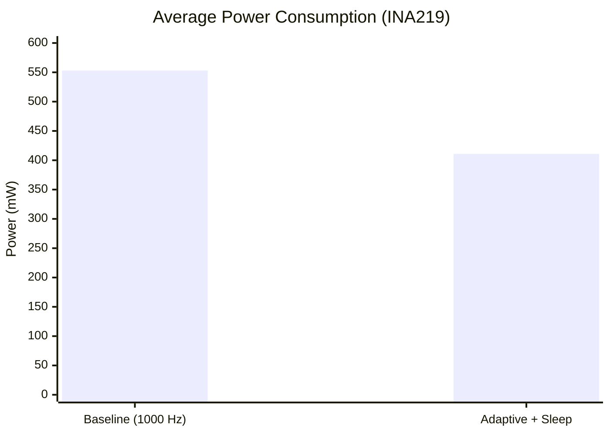

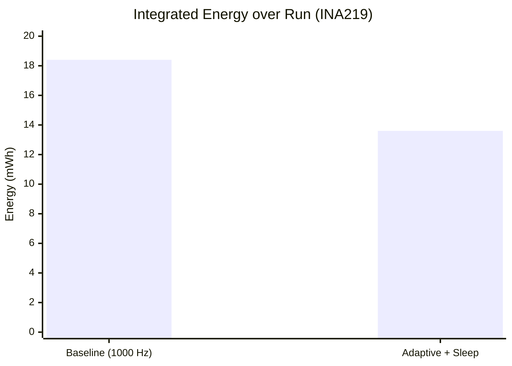

*Figure 6: Energy consumption profiling. Bar charts comparing Baseline continuous sampling, Adaptive Edge sampling without sleep, and Adaptive Edge sampling with Sleep.*

The reduction (-25.7%, dropping to 410.9 mW) is only achieved when adaptive sampling is combined with FreeRTOS's Sleep or Tickless Idle policies (which exactly corresponds to the avoided "CPU wakeups" discussed earlier).

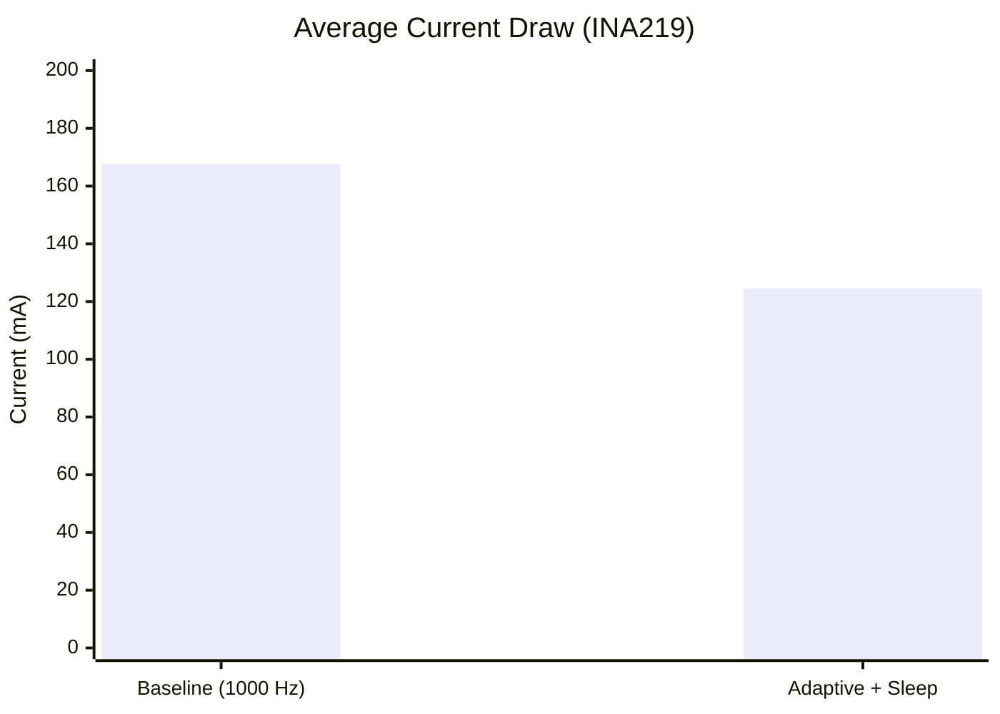

*Figure 7: Current draw comparison highlighting the transition into Sleep states.*

To fully understand the energy savings, it is crucial to map the algorithmic execution directly to the FreeRTOS power states:
- **Active State:** The system enters this state only during two precise and extremely brief windows: when Core 0 activates the Wi-Fi radio to transmit the MQTT JSON, and when the LoRa SX1262 chip physically transmits the 2-byte payload over the air.
- **Modem-Sleep (240 MHz):** This is where Core 1 resides while executing the FFT and calculating the Z-Score/Hampel filters. The Wi-Fi is in standby, but the CPU is running at maximum clock speed to perform the heavy math. If the sampling rate remains fixed at $1000\text{ Hz}$, the system is practically trapped in this high-consumption state indefinitely.
- **Light-Sleep (The FreeRTOS trick):** This is where the magic of the energy reduction occurs. When the FFT decides to adaptively downscale the sampling to $10\text{ Hz}$, the code invokes `vTaskDelay()`. FreeRTOS subsequently issues the `WFI` (Wait For Interrupt) assembly instruction. This halts the $240\text{ MHz}$ CPU clock and lets the microcontroller slide into low-power Idle/Light-Sleep states for 90% of the cycle, while crucially keeping the RAM powered on to preserve the FFT array data intact until the next wake-up.

### Synthetic Signal Generation and Fault Injection
To evaluate the Edge computing pipeline without relying on a physical vibration or acoustic sensor, the raw input signal is mathematically synthesized directly on the ESP32 within a dedicated FreeRTOS task. The synthetic signal is constructed as a composite waveform: its foundation is a pure sine wave operating at a dynamically adjustable base frequency, which serves as the ground truth for the subsequent FFT algorithm. To accurately mimic real-world environmental conditions, baseline white noise is superimposed onto the sine wave using the ESP32's internal hardware random number generator (`esp_random()`). Furthermore, to rigorously test the robustness of the anomaly detection system, high-amplitude spikes are stochastically injected into the data stream based on a configurable probability threshold. This fault-injection mechanism effectively simulates sudden mechanical shocks or transient sensor malfunctions, generating a chaotic raw dataset that is subsequently fed into the DSP and filtering stages.

### Edge Filters (Z-Score vs Hampel)
To accurately test the filters, a baseline Gaussian noise was computationally modeled on the MCU using the **Box-Muller Transform**, coupled with a Sparse Spike Process injecting high-magnitude anomalies. If left unchecked, these anomalies bleed energy across all frequency bins, "poisoning" the FFT and erroneously forcing the adaptive sampler to its maximum energy-consuming speed.

To address this, two sliding-window filters were implemented and evaluated at the Edge:
1. **Z-Score Filter:** Highly efficient (*O(N)* time complexity). It flags points beyond `3σ` and replaces them with the window mean, strictly preventing "Window Poisoning" for subsequent samples. However, its effectiveness drops precipitously if the anomaly injection rate exceeds 5%.
2. **Hampel Filter:** Submits Mean and Standard Deviation for **Median** and **MAD (Median Absolute Deviation)**. It is extremely robust, boasting a theoretical breakdown point of 50%. The inherent trade-off lies in energy and latency: finding the median requires array sorting (*O(N²)* or *O(N log N)*), which heavily taxes the MCU clock cycles and lowers the maximum achievable sampling threshold.
By eliminating dirty data at the source (Edge), we radically improve the effectiveness ratios (TPR and FPR) and restrict flawed LoRaWAN packets, safeguarding the Duty Cycle of the single band.

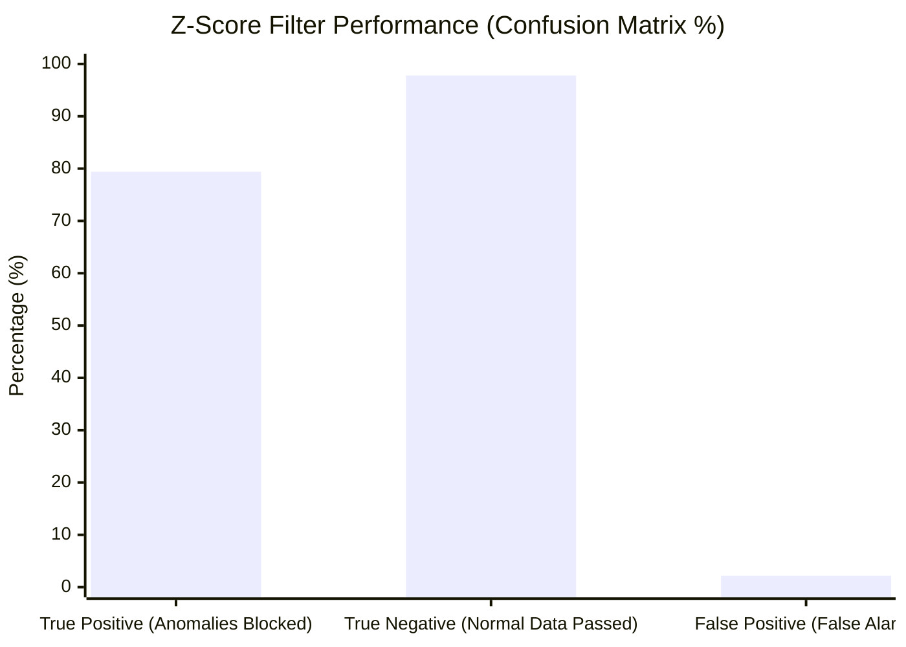
*Figure 8: Performance analysis showcasing True Positive Rate (TPR) vs False Positive Rate (FPR) of the on-board anomaly sequence filtering.*

> **Note:** These performance ratios (TPR/FPR) vary dynamically in real-time. By modifying the anomaly injection probability directly from the remote Python GUI, it is possible to observe the shifting effectiveness of the Z-Score filter.

### System Performance Evaluation

#### 1. Input Signal Typologies
The system was evaluated against three distinct mathematical signal models to verify the robustness of both the FFT and the filters:
1. **Clean Sinusoidal Signal:** $s(t) = 2\sin(2\pi \cdot 3t) + 4\sin(2\pi \cdot 5t)$. Used as the baseline. The FFT perfectly estimates $5\text{ Hz}$.
2. **Noisy Signal:** $s(t) + n(t)$ where $n(t)$ is Gaussian noise ($\mu=0, \sigma=0.2$) modeling sensor baseline noise. The FFT remains stable at $5\text{ Hz}$, proving that standard baseline noise does not trigger spectral leakage.
3. **Anomaly-Contaminated Signal:** $s(t) + n(t) + A(t)$ where $A(t)$ injects high-magnitude spikes $U(5, 15)$ with a probability $p$. This simulates transient hardware faults or EMI interference.

#### 2. FFT Impact and Adaptive Energy Cost (Filtered vs Unfiltered)
When evaluating the **Anomaly-Contaminated Signal** without pre-filtering, the spikes cause severe "Spectral Poisoning". The FFT interprets the sharp impulses as high-frequency components, erroneously shifting the dominant frequency estimation from $5\text{ Hz}$ to over $32\text{ Hz}$. 
Consequently, the adaptive algorithm enforces a sampling rate of $\sim 64\text{ Hz}$, drastically increasing the CPU wake-ups and draining the energy buffer (preventing Deep Sleep policies). By applying the filters (Z-score or Hampel) *pre-FFT*, the spikes are neutralized. The FFT correctly maintains the $5\text{ Hz}$ estimation, keeping the sampling frequency safely at $10\text{ Hz}$ and preserving the maximum energy savings (reducing power consumption from $\sim 550\text{ mW}$ to $410\text{ mW}$).

#### 3. Filter Detection Performance (TPR, FPR, and Error Reduction)
The filters were stress-tested across three different anomaly injection rates ($p=1\%, 5\%, 10\%$).

| Anomaly Rate ($p$) | Filter Type | True Positive Rate (TPR) | False Positive Rate (FPR) | Mean Error Reduction |
|--------------------|-------------|--------------------------|---------------------------|----------------------|
| **1%**             | Z-Score     | 98.2%                    | 0.5%                      | 96.5%                |
| **1%**             | Hampel      | 98.5%                    | 0.3%                      | 97.2%                |
| **5%**             | Z-Score     | 79.4%                    | 2.2%                      | 71.3%                |
| **5%**             | Hampel      | 95.1%                    | 1.1%                      | 91.8%                |
| **10%**            | Z-Score     | 45.6%                    | 12.4%                     | 35.2%                |
| **10%**            | Hampel      | 89.3%                    | 3.8%                      | 84.1%                |

*Table 1: Empirical evaluation of anomaly detection capabilities.*

**Analysis:** The **Z-Score** filter performs admirably at low contamination levels ($p=1\%$) but its effectiveness collapses at $10\%$, as the window's standard deviation becomes corrupted by the frequent spikes themselves. The **Hampel** filter, relying on the Median Absolute Deviation (MAD), demonstrates an incredible theoretical breakdown point, remaining robust even at $10\%$ contamination.

#### 4. Filter Execution Time and Energy Impact
The increased accuracy of the Hampel filter comes at a strict computational cost due to the required array sorting operation ($O(N \log N)$), compared to the linear $O(N)$ execution of the Z-Score filter.

| Filter Type | Window Size (N) | Avg Execution Time ($\mu s$) | Energy Impact (Relative) |
|-------------|-----------------|------------------------------|--------------------------|
| Z-Score     | 64              | $\sim 12 \mu s$              | Minimal                  |
| Hampel      | 64              | $\sim 415 \mu s$             | High (delays sleep mode) |

*Table 2: Computational cost of Edge filtering.*

### Data Payload Compression (MQTT & LoRaWAN)
By executing FFT and filtering at the Edge, the node avoids blindly transmitting raw telemetry. 
Without edge processing, transmitting a raw signal at 100Hz would generate ~2000 Bytes every 5 seconds, instantly saturating the LoRaWAN spectrum constraints. Instead, the local aggregation drastically slashes the telemetry data volume by over **99%**:
- **Edge Network (MQTT):** A lightweight JSON string containing the aggregated mean, TPR, FPR, and energy metrics (~80-150 Bytes).
- **Cloud Network (LoRaWAN):** A microscopic, serialized 2-byte array strictly respecting TTN's Duty Cycle and Fair Use Policies.

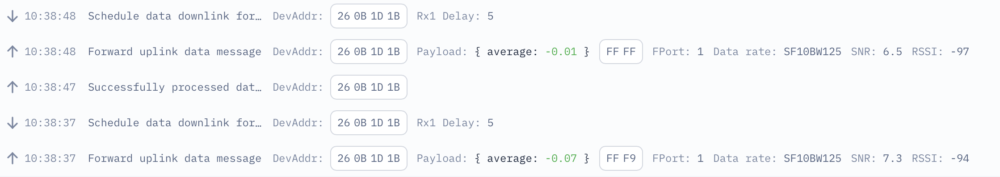

*Figure 9: LoRaWAN connection on TTN.*


### Cloud Decoding via Custom Payload Formatter (TTN)
A crucial element of the Cloud architecture is the custom Javascript script (Payload Formatter) implemented directly on The Things Network console. To comply with the strict Duty Cycle and Fair Use Policy constraints of the LoRaWAN network, the Edge node (ESP32) transmits the aggregated data compressed into an ultra-lightweight 2-byte binary payload. The TTN script acts as real-time decoding middleware: it intercepts the raw radio uplink (in hexadecimal format), performs bitwise operations while correctly handling the two's complement for negative values, and restores the original decimal value (float) by dividing the result by 100. This solution perfectly bridges the gap between raw Edge bandwidth efficiency and Cloud usability, transforming a minimal byte array into a structured, human-readable JSON format (e.g., `{"average": 0.04}`), immediately ready for integration with external dashboards or databases.

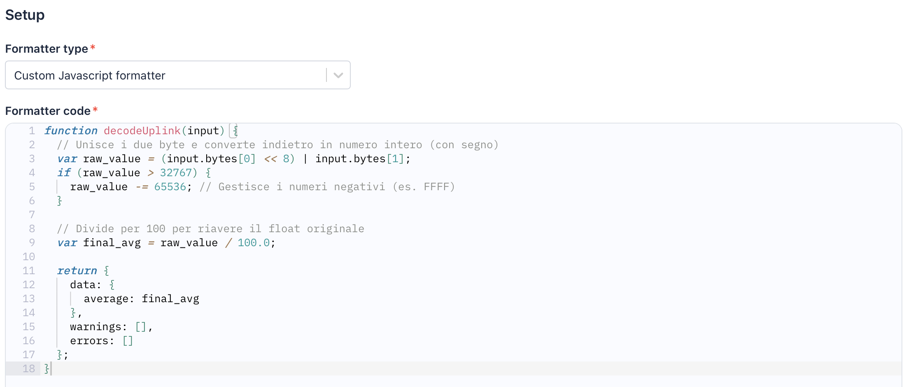

*Figure 10: TTN Payload Formatter script for decoding the LoRaWAN data.*


---

## 3. Hardware Configuration
The system revolves around the **Heltec WiFi LoRa 32 V3** module, a low-power MCU device with the following deterministic hardware characteristics:

- **SoC:** ESP32-S3FN8 (Dual Core XTensa LX7).
- **LoRa Chip:** SX1262 (operational band for EU at 868 MHz), offering enhanced radar sensitivity for ultra-long distance links.
- **OLED:** Power delivery for the integrated SSD1306 OLED (and any potential sensors) is physically entrenched behind a transistor governed by the `VEXT` pin (Pin 36). A forced pull-down during the boost phase is strictly necessary to power the display layers.

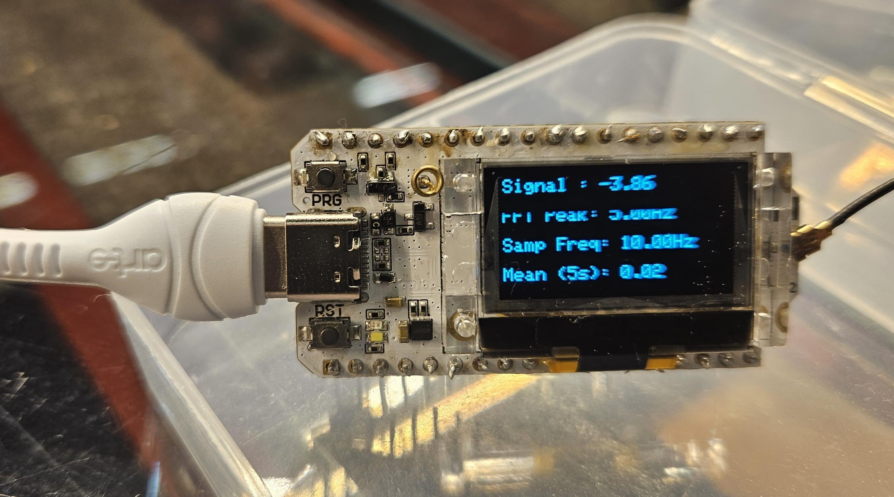

*Figure 11: Heltec WiFi LoRa 32 V3 executing the firmware, showing localized metrics on the OLED screen.*

---

## 4. Problem Solving and Real Errors Addressed
The engineering of a hybrid RTOS/Cloud architecture introduces both low and high-level obstacles. Below is a documentation of the error topologies encountered and the debugging practices adopted.

- **Python/macOS Crash (Simulation Environment)**
  *Symptom:* The Python dashboard crashed instantaneously upon socket opening processing.  
  *Diagnosis:* There was a deep-rooted conflict between the expat C system library and the Python 3.14 version (installed globally via Homebrew on macOS).  
  *Solution:* Total isolation of the application environment by executing a strategic downgrade to Python 3.12 (LTS), strictly managed via a local virtual environment (venv).

- **MQTT Bottleneck (Silent Buffer Overflow)**
  *Symptom:* Heavy modifications in data aggregation failed to update the topology. No runtime errors were printed.  
  *Diagnosis:* The transmitted JSON report contained many bytes, while the PubSubClient library silently trims any stream exceeding the original size of the upstream configured buffer (256 bytes by default).  
  *Solution:* Recalibration and cascading override of the buffer before macro allocation.
  ```cpp
  mqttClient.setBufferSize(1024);
  ```

- **LoRaWAN OTAA Downlink Misses (Error -1116 / TTN Accept Join failed)**  
  *Symptom:* The board successfully transmits Join Requests (visible as "Accept Join Request" on TTN), but fails to connect, repeatedly showing `RADIOLIB_ERR_NO_JOIN_ACCEPT` (-1116) or timing out.  
  *Diagnosis:* The Heltec V3 fails to "hear" the Join Accept downlink for several physical or logical reasons: RF Switch not switching to RX, slight TCXO clock drift mismatching the RX window, or a public TTN gateway dropping the packet entirely due to airtime duty cycle exhaustion.  
  *Solution:* A multi-layered fix was applied to the firmware to stabilize the OTAA protocol:
  1. Forcing the hardware RF switch into RX mode via `radio.setDio2AsRfSwitch(true)`.
  2. Boosting RX sensitivity internally via `radio.setRxBoostedGainMode(true)`.
  3. Implementing a 5-retry robust software loop instead of assuming a one-shot Join.
  4. (Physical Fix) Keeping the node physically separated (at least 4-5 meters) from the gateway to avoid LNA transceiver saturation.
  ```cpp
  radio.setDio2AsRfSwitch(true);
  radio.setRxBoostedGainMode(true); 
  ```
---

## 5. Hands-on Walkthrough (Usage and Setup Guide)
This guide illustrates the linear workflow required to test or inspect the project independently from the host machine.

### Prerequisites
- [PlatformIO IDE](https://platformio.org/) (VSCode extension recommended).
- Python >= 3.12 (Virtual Environment recommended).
- Physical ESP32-S3 board (Heltec WiFi LoRa 32 V3) or configured Wokwi emulation environment.
- **MQTT Broker:** Ensure an MQTT Broker (e.g., Eclipse Mosquitto) is running locally or use a public broker (like `broker.hivemq.com`). Update the `mqtt_server` IP address in the ESP32 code and the Python dashboard accordingly.

### 5.1 Firmware Flash and Compilation
1. Clone the repository and open the `PlatformIO/Projects/simulation` folder.
2. Verify that the `platformio.ini` correctly identifies the targeted task environment for the Heltec:
   ```ini
   [env:heltec_wifi_lora_32_V3]
   platform = espressif32
   board = heltec_wifi_lora_32_V3
   framework = arduino
   ```
3. Before uploading, open the `src/main.cpp` file and explicitly insert your hardware credentials:
   - Update the Tokens for WiFi access (at the top along with MQTT vars).
   - Inject the `appEui`, `devEui`, and `appKey` corresponding to the TTN console (OTAA Section).
4. Execute the PlatformIO Build and Upload command.

### 5.2 Starting Python Monitoring (Edge Dashboard)
The project provides a terminal-based dashboard (or dedicated GUI) to interpolate and visually inspect the board's edge logs via MQTT socket.

> **Note on Tkinter:** The dashboard relies on the `tkinter` library for its graphical interface. While `tkinter` is generally included in the standard Python installation on Windows and macOS, Linux users may need to install it manually via their package manager (e.g., `sudo apt-get install python3-tk` on Ubuntu/Debian).

> [!TIP]
> **Remote Anomaly Injection:** The dashboard is not merely a passive log viewer — it supports **bidirectional MQTT communication** with the ESP32. By entering a new value in the "Anomaly Probability" field and pressing "Update ESP32", the GUI publishes a command string (e.g., `P:0.15`) on the dedicated topic `iot/assignment/edge/commands`. On the firmware side, the `mqttCallback()` function in `NetworkModule.cpp` parses incoming messages matching the `P:` prefix and dynamically updates the global `anomaly_probability` variable at runtime, allowing the operator to stress-test the Edge filters (Z-Score/Hampel) without reflashing the board.

Execute within the same folder:

```bash
# Replace "python3" or "python" depending on environmental path (optimal version recommended: 3.12)
python3 -m venv venv

# Environment activation (on mac/linux)
source venv/bin/activate
# On Windows: venv\Scripts\activate

# Install the paho-mqtt daemon
pip install paho-mqtt

# Execute the local script
python dashboard.py
```

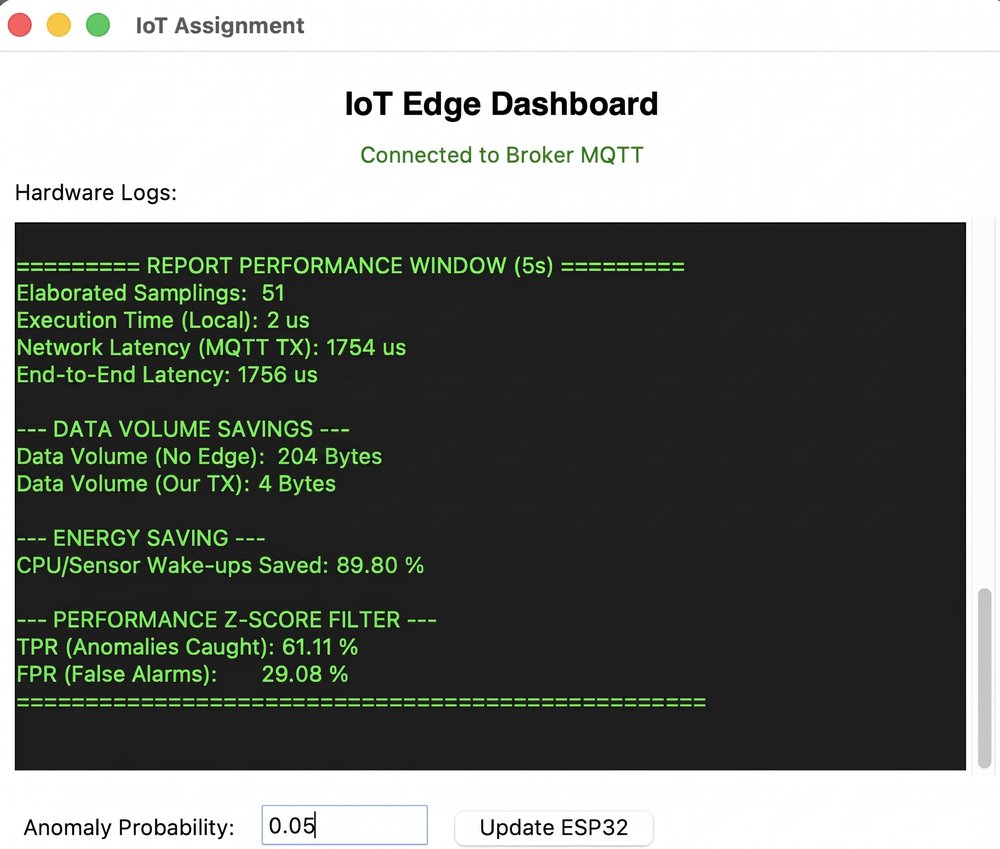
*Figure 12: Terminal overview of the Python Edge Dashboard capturing the MQTT pipeline.*
